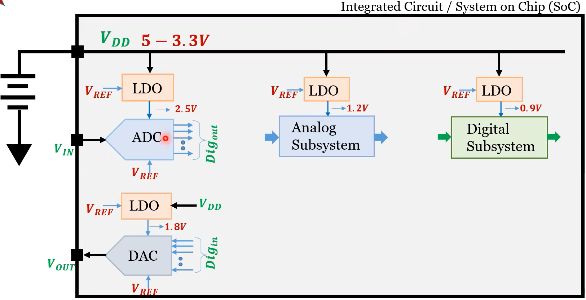

# Bandgap
Analog Bandgap IP Design using Sky130 PDKs

## Table of contents

- [Bandgap_Sky130nm_VSD](#bandgap_sky130nm_vsd)
  - [Table of contents](#table-of-contents)
  - [Introduction](#introduction)
  - [Design Specifications](#design-specifications)
  - [Tools used](#tools-used)
  - [Bandgap Design Theory](#bandgap-design-theory)
    - [General Overview](#general-overview)
    - [CTAT Voltage Generation Circuit](#ctat-voltage-generation-circuit)
    - [PTAT Voltage Generation Circuit](#ptat-voltage-generation-circuit)
    - [Biased Current Mirror Circuit](#ctat-voltage-generation-circuit)
    - [Reference Voltage Branch Circuit](#ctat-voltage-generation-circuit)
    - [Start-up Circuit](#ctat-voltage-generation-circuit)
    - [Complete BGR Circuit](#ctat-voltage-generation-circuit)
  - [Bandgap Design Labs using Sky130](#bandgap-design-labs)
    - [Lab1 Tools and PDK setup](#lab1-tools-and-pdk-setup)
    - [Lab2 Design spec, Device data, Design Steps](#lab2-design-spec-device-data-design-steps)
    - [Lab3 Component Design with spice netlist](#lab3-component-design-with-spice-netlist)
    - [Lab4 CTAT design and prelayout simulation](#lab4-ctat-design-and-prelayout-simulation)
    - [Lab5 PTAT design and prelayout simulation](#lab5-ptat-design-and-prelayout-simulation)
    - [Lab6 BGR (ideal) design and prelayout simulation](#lab6-bgr-ideal-design-and-prelayout-simulation)
    - [Lab7 Complete BGR Design and prelayout simulation](#lab7-complete-bgr-design-and-prelayout-simulation)
    - [Lab8 Detailed Startup Circuit Simulation](#lab8-detailed-startup-circuit-simulation)
    - [Lab9 Layout of Components](#lab9-layout-of-components)
    - [Lab10 Top Level Layout Extraction LVS Postlayout Simulation Final](#lab10-top-level-layout-extraction-lvs-postlayout-simulation-final)
  - [Author](#author)
  - [Future Work](#future-work)
  - [Contributions](#contributions)
  - [Acknowledgements](#acknowledgements)

## Introduction
   This Git hub repository is cloud based workshop contains simulation data for Analog Bandgap IP Design using Sky130nm.
## Design Specifications

## Tools Used

## Bandgap Design Theory

### General Overview

  
The IC Shown above and many other ICs System require a reference voltage source which is provided by PVT independent biasing circuit. As shown above this IC system can have Analog, Digital subsystems, ADC, DAC and so on; these subsystems get their supply voltage from LDO (Linear Voltage Regulator) and input to these LDO's is same reference voltage source as mentioned above.

This PVT independent biasing ciruit has typical temperature co-efficient of 10-50 ppm/degreeC(~10-50 uV/degreeC for VRef=1V) and typical power-supply rejection 40-60 dB (10-1 mV/V)

### CTAT Voltage Generation Circuit

### PTAT Voltage Generation Circuit

### Biased Current Mirror Circuit

### Reference Voltage Branch Circuit

### Start-up Circuit

### Complete BGR Circuit

## Bandgap Design Labs 

### Lab1 Tools and PDK setup

### Lab2 Design spec, Device data, Design Steps

### Lab3 Component Design with spice netlist

### Lab4 CTAT design and prelayout simulation

### Lab5 PTAT design and prelayout simulation

### Lab6 BGR (ideal) design and prelayout simulation

### Lab7 Complete BGR Design and prelayout simulation

### Lab8 Detailed Startup Circuit Simulation

### Lab9 Layout of Components

### Lab10 Top Level Layout Extraction LVS Postlayout Simulation Final

## Author
- Manish Ratnani

## Future Work

## Contributions
- Manish Ratnani
- Kunal Ghosh
- Prof. Santunu Sarangi
- Prof. Saroj Rout
- Subham Rath

## References
- [Bandgap Reference Circuit](https://github.com/vsdip/vsdopen2021_bgr)

## Acknowledgements
- Kunal Ghosh, Co-founder, VSD Corp. Pvt. Ltd.
- Prof. Santunu Sarangi (SIT)
- Prof. Saroj Rout (SIT)
- Subham Rath (SIT) 
